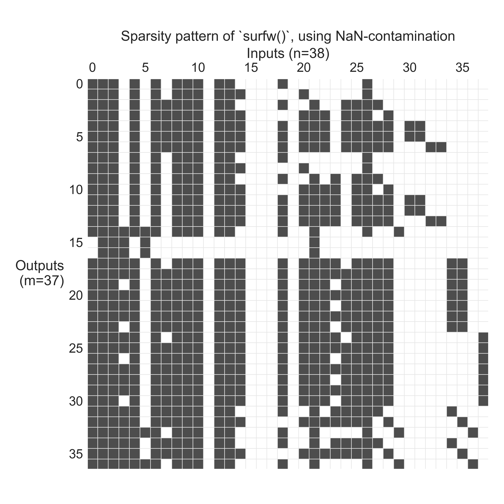
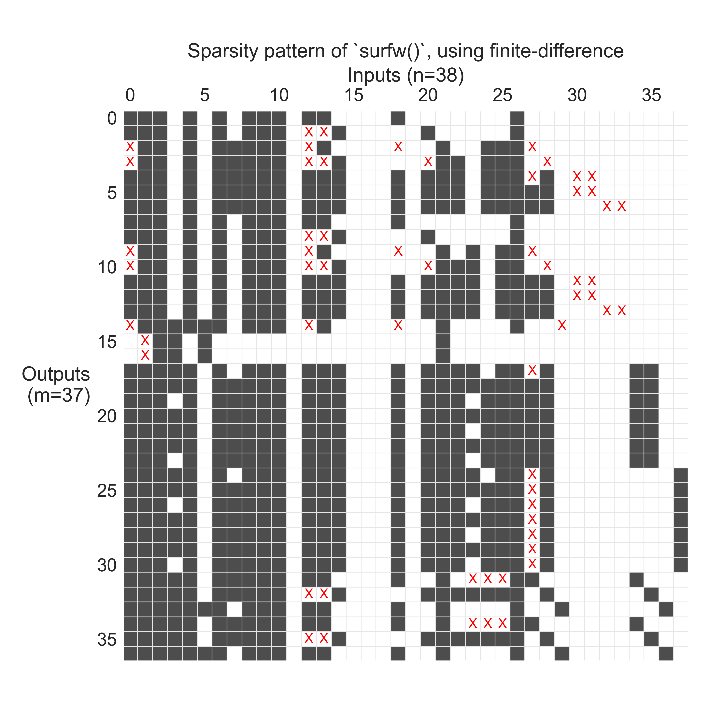

# NaN Propagation

By Peter Sharpe

-----

[*From the paper abstract:*](#paper)

When numerically evaluating a function's gradient, sparsity detection can enable substantial computational speedups through Jacobian coloring and compression. However, sparsity detection techniques for black-box functions are limited, and existing finite-difference-based methods suffer from false negatives due to coincidental zero gradients. These false negatives can silently corrupt gradient calculations, leading to difficult-to-diagnose errors. 

We introduce NaN-propagation, which exploits the universal contamination property of IEEE 754 Not-a-Number values to trace input-output dependencies through floating-point numerical computations. By systematically contaminating inputs with NaN and observing which outputs become NaN, the method reconstructs conservative sparsity patterns that eliminate a major source of false negatives. We demonstrate this approach on an aerospace wing weight model, achieving a 1.52× speedup while uncovering dozens of dependencies missed by conventional methods -- a significant practical improvement since gradient computation is often the bottleneck in optimization workflows. The technique leverages IEEE 754 compliance to work across programming languages and math libraries without requiring modifications to existing black-box codes. 

Furthermore, advanced strategies such as NaN payload encoding via direct bit manipulation enable faster-than-linear time complexity, yielding speed improvements over existing black-box sparsity detection methods. Practical algorithms are also proposed to mitigate challenges from branching code execution common in engineering applications.

## Example

The figure below shows a sparsity pattern reconstructed using NaN propagation for a black-box computational function -- in this case, a wing weight model:



Compared to a baseline method that uses finite-differenced gradients as a heuristic for global sparsity, NaN propagation corrects many errors. Below is the baseline method, with missed dependencies highlighted in red:



## Repo

This repository contains both:
- A reference implementation of the NaN propagation algorithm in Python
- The LaTeX source for the associated paper that describes some of these ideas

## Paper

Read more about NaN propagation in this paper: [Peter Sharpe, "NaN-Propagation: A Novel Method for Sparsity Detection in Black-Box Computational Functions", 2025.](https://arxiv.org/abs/2507.23186)

```bibtex
@article{sharpe2025nanpropagation,
  title={NaN-Propagation: A Novel Method for Sparsity Detection in Black-Box Computational Functions},
  author={Sharpe, Peter},
  journal={arXiv preprint arXiv:2507.23186},
  year={2025},
  url={https://arxiv.org/abs/2507.23186}
}
```

An earlier version of this work is also available in this thesis: [Peter Sharpe, "Accelerating Practical Engineering Design Optimization with Computational Graph Transformations", 2024.](https://dspace.mit.edu/handle/1721.1/157809) (Chapter 6, pg. 240-264)

```bibtex
@phdthesis{sharpe2024accelerating,
  title={Accelerating Practical Engineering Design Optimization with Computational Graph Transformations},
  author={Sharpe, Peter},
  year={2024},
  school={Massachusetts Institute of Technology},
  url={https://dspace.mit.edu/handle/1721.1/157809}
}
```